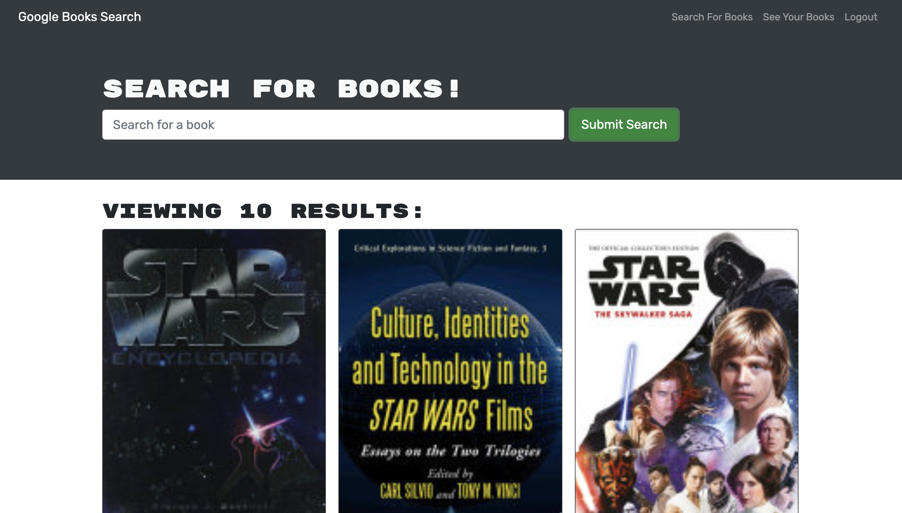

# Coding Bootcamp Week 21 Challenge - Book Search Engine

## Description

This week's challenge focused on replacing the RESTFUL API with GraphQL API in a Google book search website.

## Built With

- MongoDB
- Express
- React
- Node.js
- GraphQL

## Usage

To access the website, click the link below.

https://brodie02.github.io/react-portfolio-good/

## Credits

Made by [Brodie Marshall](https://github.com/brodie02)

---
